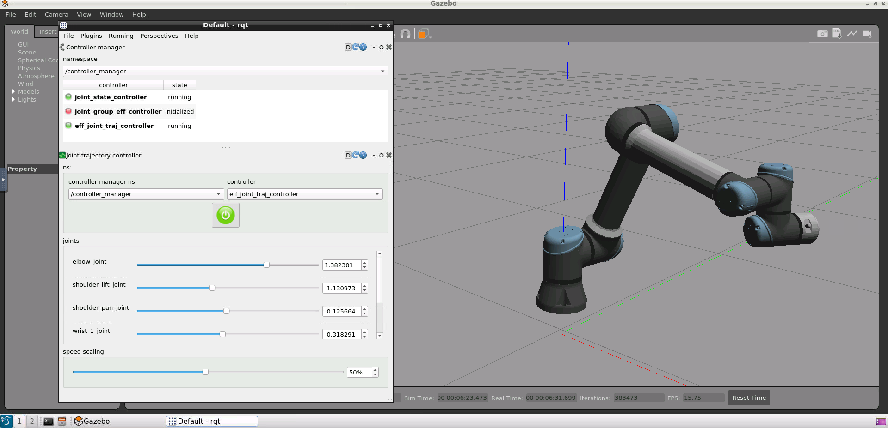

# **Industrial Robots: Getting started for 

You have the official "universal robot" package already installed in "src" folder. To verify the correct installation follow first instructions in:
- https://github.com/ros-industrial/universal_robot


## **3.1. Getting started**

You can use the "universal_robot" package to control the ur5e robot arm

- Bringup your ur5e robot arm:
```shell
roslaunch ur_gazebo ur5e_bringup.launch
```
**Control joint angle values**

This can be done using rqt.

The rqt tool has two interesting plugins for control purposes:

- The Robot Tools/Controller Manager: To load, unload, start and stop controllers.

- The Robot Tools/Joint Trajectory Controller: To move the robot joints using a Joint Trajectory Controller.

Verify you have installed:
```shell 
sudo apt install ros-noetic-rqt-controller-manager
sudo apt install ros-noetic-rqt-joint-trajectory-controller
```
Type:
```shell
rosrun rqt_joint_trajectory_controller rqt_joint_trajectory_controller
```

Information is:

- https://www.youtube.com/watch?v=3C_F8vhnUPI
- https://classic.gazebosim.org/tutorials?tut=ros_control

You can access to each robot joint:


**Control position TCP**

- There are launch files available to bringup a simulated robot. To bring up the simulated robot in Gazebo, run:
```shell
roslaunch ur_gazebo ur5_bringup.launch
```
- MoveIt! with a simulated robot. You can use MoveIt! to control the simulated robot. For setting up the MoveIt! nodes to allow motion planning run:
```shell
roslaunch ur5_moveit_config moveit_planning_execution.launch sim:=true
```

- For starting up RViz with a configuration including the MoveIt! Motion Planning plugin run:
```shell
roslaunch ur5_moveit_config moveit_rviz.launch
```
- Test a "random feasible" target to verify the correct behaviour

## **3.2. Custom Control**

We can create a specific package for joint and POSE control.

- Create the "industrial_ur_control" package with dependencies:
  - moveit_core
  - moveit_ros_planning_interface
  - std_msgs
  - geometry_msgs
  - rospy

```shell
catkin_create_pkg industrial_ur_control rospy moveit_core moveit_ros_planning_interface std_msgs geometry_msgs
```
- Create "launch" and "src" folders

**Bringup**

- Create "industrial_ur5e_bringup.launch" file in "launch" folder
```shell
roslaunch industrial_ur_control industrial_ur5e_bringup.launch
```

**Joints control**

- Create "ur5e_joints_control.py" file in "src" folder
- Create "ur5e_joints_control.launch" file in "launch" folder

```shell
roslaunch industrial_ur_control ur5e_joints_control.launch
```  

**POSE control**

- Create "ur5e_pose_control.py" file in "src" folder
- Create "ur5e_pose_control.launch" file in "launch" folder

```shell
roslaunch industrial_ur_control ur5e_pose_control.launch
``` 


